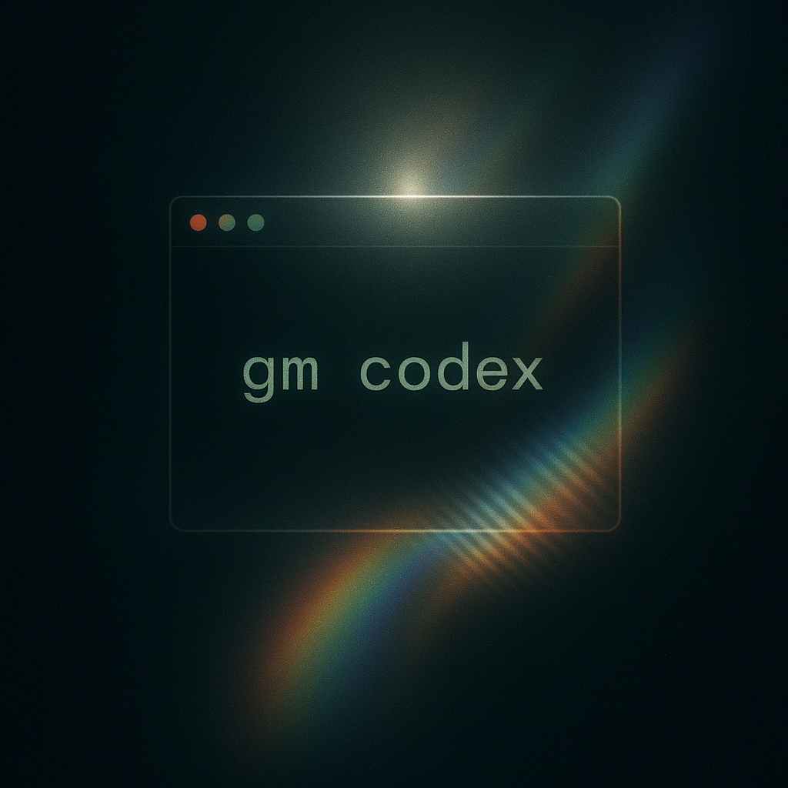

# GM Codex 🧙‍♂️⚔️

<div align="center">

</div>

GM Codex is an upcoming command-line interface (CLI) tool designed for Game Masters (GMs) who want to run smoother, more organized encounters in their tabletop role-playing game (TTRPG) sessions. Whether you’re tracking initiative, managing monsters, or keeping tabs on player actions, GM Codex is your digital encounter command center.

## Features ✨

- **Encounter Management**: Effortlessly track initiative, add/remove creatures, and monitor status effects all in the terminal!
- **Monster & NPC Tracking**: Keep all your monsters, NPCs, and their stats at your fingertips.
- **Quick Commands**: Run encounters, update statuses, and resolve combat with simple CLI commands.
- **Extensible Design**: Built with C# and .NET

## Installation 🛠️

1. Clone the repository:
    ```bash
    git clone https://github.com/krigrin/gm-codex.git
    cd gm-codex/
    ```

2. Pack the tool into a NuGet pakcage:
    ```bash
    dotnet pack -c Release
   ```
   This will create a `.nupkg` file in the `./nupkg` folder in the `gm_codex.Presentation` folder.


3. Install the tool globally from the local package:
    ```bash
    dotnet tool install --global --add-source ./gm_codex.Presentation/nupkg gm-codex --version 1.0.0
    ```

   > ⚠️ Note: The **package id** is `gm-codex`, and the installed **command** is also `gm-codex` (set in the project file).
   > If you previously installed an older version, uninstall it first:
   > ```bash
   > dotnet tool uninstall --global gm-codex
   > ```

4. Verify installation:
    ```bash
    dotnet tool list --global
    ```

## Usage 🚀

Once installed, you can run the tool from **anywhere** in your terminal:

```bash
gm-codex list pc
gm-codex create pc
```
### Updating after changes
If you make changes to the code:
```bash
dotnet pack -c Release
dotnet tool update --global --add-source ./gm_codex.Presentation/nupkg gm-codex --version 1.0.1
```

### Uninstall
```bash
dotnet tool uninstall --global gm-codex
```

## Build And Pack (Just)

If you want quick root-level commands, use `just`:

```bash
just build
just build-release
just test
just run
just pack
```

Install `just` if you do not have it:
```bash
brew install just
```

Notes:
- `just pack` packages the Presentation project in Release mode.
- The `.nupkg` is written to `gm_codex.Presentation/nupkg`.

### Development Shortcuts

You can run the CLI during development with either of these:

```bash
just run <command>
```

Or directly with dotnet:

```bash
dotnet run --project gm_codex.Presentation <command>
```

## Naming Ideas 💡

- TTRPG Console
- GMOS (Game Master Operating System)
- Arcane Shell
- GM Command Station
- GM Terminal
- Dungeon Ledger
- GM Screen
- gmctl
- Battle Bard

---

Made with ❤️ by [krigrin](https://github.com/krigrin) and [Adrianhammer](https://github.com/Adrianhammer)
